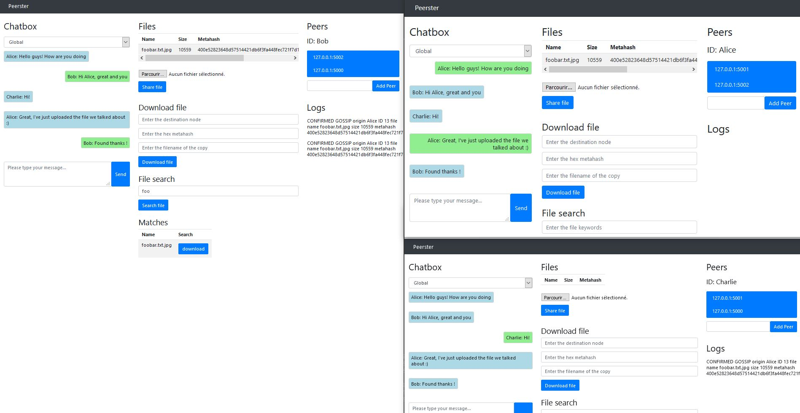

# Peerster

Peerster is a decentralized messaging and file sharing application written in Go. It allows users to exchange messages, upload/download and search for availabable files in the network. 
Each node communicates with other peers on its gossip port, and with clients on the `UIPort`. Alternatively, each node provides a GUI on its `GUIPort`.


# Usage

Commands for the example above:

`./Peerster --UIPort 12345 --gossipAddr 127.0.0.1:5000 --name Alice --peers 127.0.0.1:5001,127.0.0.1:5002 --antiEntropy 10 --rtimer 
10 --GUIPort 8080 --stubbornTimeout 10`

`./Peerster --UIPort 12346 --gossipAddr 127.0.0.1:5001 --name Bob --peers 127.0.0.1:5002  --antiEntropy 10 --rtimer 10 --GUIPort 8081 --stubbornTimeout 10`

`./Peerster --UIPort 12347 --gossipAddr 127.0.0.1:5002 --name Charlie --peers 127.0.0.1:5001 --antiEntropy 10 --rtimer 10 --GUIPort 
8082 --stubbornTimeout 10`


```
Usage of ./Peerster:
  -GUIPort string
        Port for the graphical interface
  -N int
        Network size
  -UIPort string
        port for the UI client (default "8080")
  -antiEntropy int
        Use the given timeout in seconds for anti-entropy (relevant only for Part 2. If the flag is absent, the default anti-entropy duration is 10 seconds (default 10)
  -gossipAddr string
        ip:port for the gossiper (default "127.0.0.1:5000")
  -name string
        name of the gossiper
  -peers string
        comma separated list of peers of the form ip:port
  -rtimer int
        Timeout in seconds for anti-entropy. If the flag is absent, the default anti-entropy duration is 10 seconds.
  -simple
        run gossiper in simple broadcast mode
  -stubbornTimeout int
        Stubborn timeout  (default -1)
```

```
Usage of ./client/client:
  -UIPort string
        port for the UI client (default "8080")
  -budget string
        Search budget
  -dest string
        destination for the private message
  -file string
        file to be indexed by the gossiper
  -keywords string
        Search keywords
  -msg string
        message to be sent
  -request string
        Request of a chunk or metafile of this hash
```
